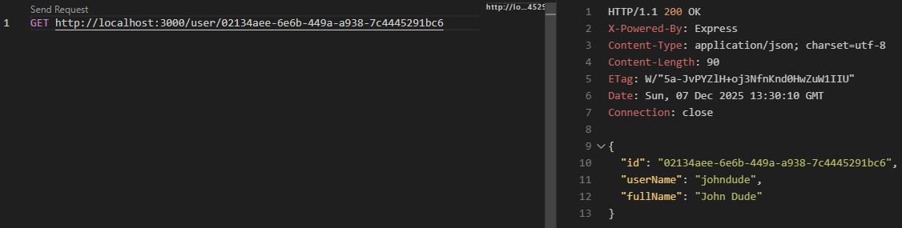
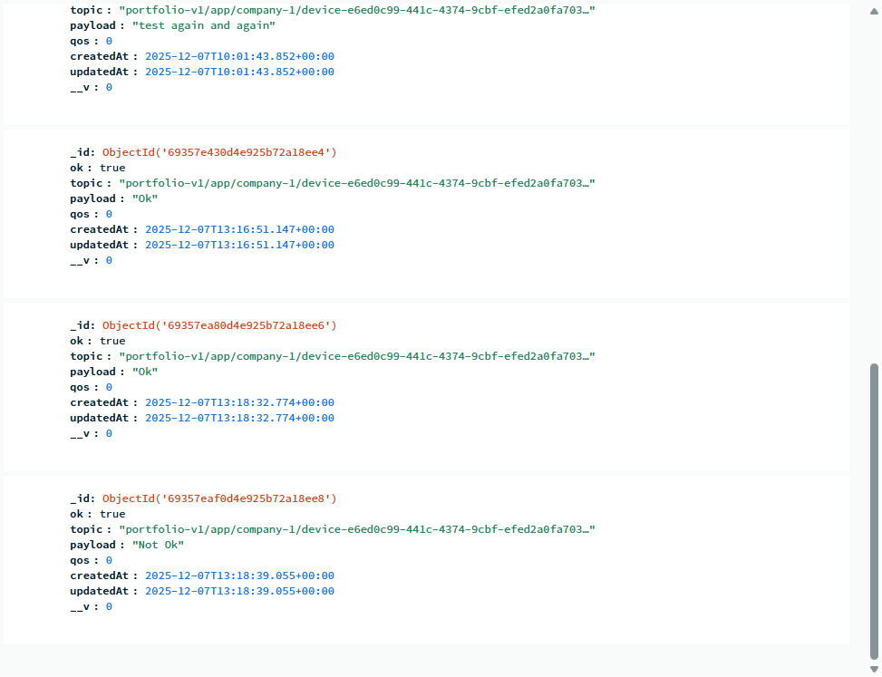
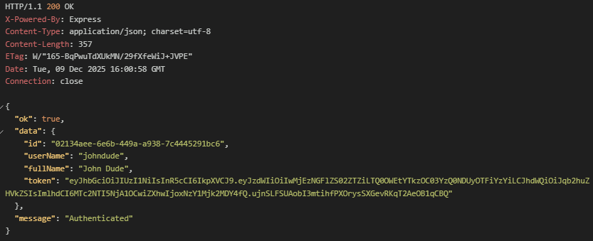
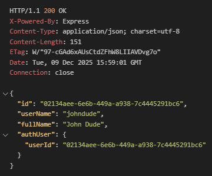
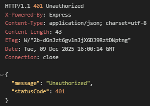

## Description

This is a quick prototype to showcase ability working in Nest.js environment. What I love about working with Nest.js is the MVC architectural pattern and how almost identical it is to Angular. 

This prototype is a weekender work, but eventually it should showcase these implementations -:

 - [X] Scaffolding Relational DB containing User table and a Test User
 - [X] Relational Data Access via ORM (Prisma 5.14.0)
 - [X] MQTT Topic subscription handling
 - [X] Non-relational Data Access via ORM for MQTT Topics (Mongoose 8.20.2)
 - [X] Salted Hash Authentication Handling
 - [X] JWT Authentication
 - [ ] Foundational CRUD

At this point of commit, Nest.js serves to talk to two data sources and two DBs. They are -:

### Data Sources

#### 1. Relational User Data from Local SQL DB

##### Fig 1. Getting User By ID from User Entity in Local SQL DB
<p align="center">
  
</p>


#### 2. Non-relational Device Data from HiveMQ's Public Broker to MongoDB Atlas Cloud

##### Fig 2. Message Publish from Hive MQ
<p align="center">
  
</p>

##### Fig 3. Message stored in MongoDB Atlas
<p align="center">
  
</p>


#### 3. JWT Authentication Guard

##### Fig 4. Token issued on successful login
<p align="center">
  
</p>

##### Fig 5. 200 on guarded route request when token is still alive
<p align="center">
  
</p>

##### Fig 6. 401 on guarded route request when token has expired
<p align="center">
  
</p>


## Project setup

```bash
$ npm install
```

## Compile and run the project

```bash
# development
$ npm run start

# watch mode
$ npm run start:dev
```

## Resources

- [NestJS Documentation](https://docs.nestjs.com)
- [Github Copilot] Used in Ask mode to speed up developments and learning/re-learning. I do not use Agent mode.
- [Prisma 5.14.0](https://www.prisma.io/docs/orm/prisma-client/queries/crud)
- [HiveMQ Public MQTT Broker](https://www.hivemq.com/mqtt/public-mqtt-broker/)
- [MongoDB Atlas Free Tier](https://www.mongodb.com/products/platform/atlas-database)

## Main Libraries Licenses

- Nest is [MIT licensed](https://github.com/nestjs/nest/blob/master/LICENSE).
- Prisma is [Apache 2.0 licenses]
- MQTT is [MIT licensed]
